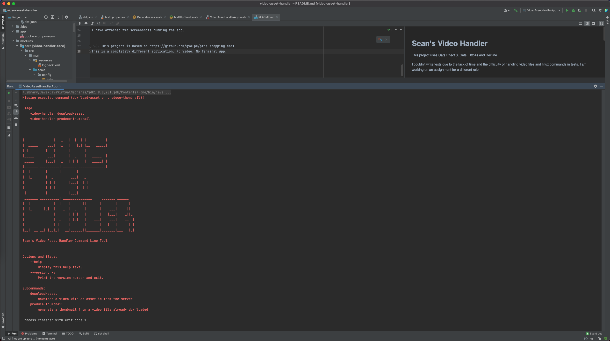
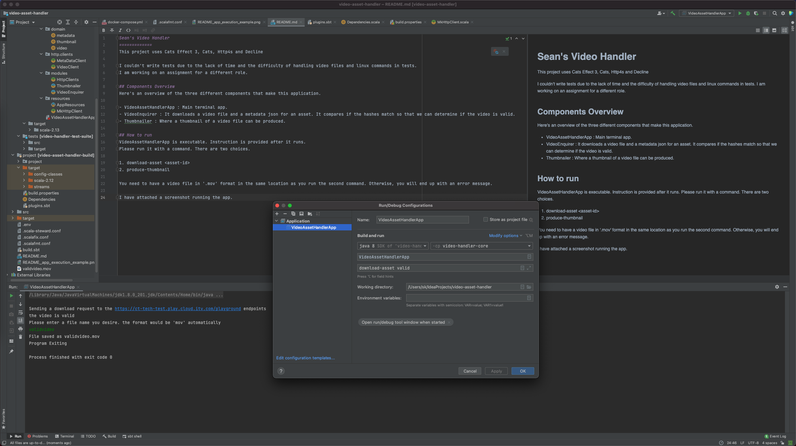
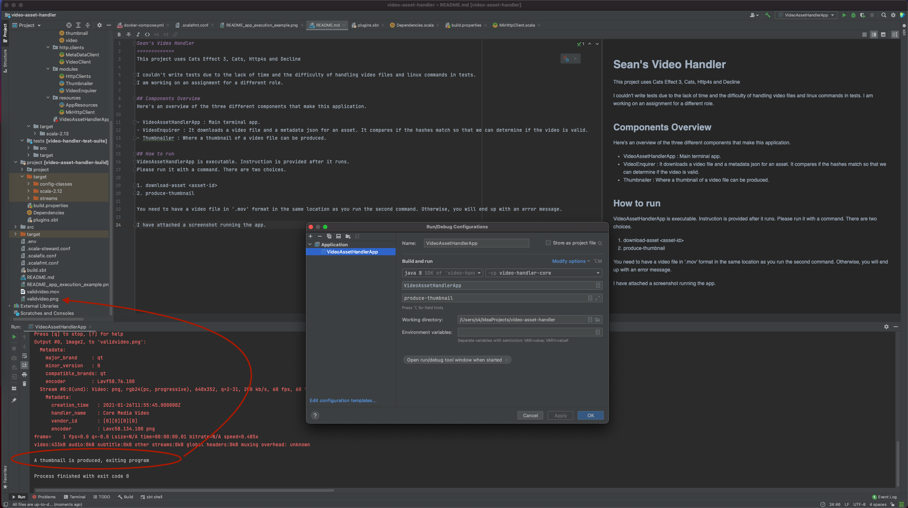

Sean's Video Handler
=============
This project uses Cats Effect 3, Cats, Http4s and Decline. This project requires `ffmpeg` to be installed locally.

## Components Overview
Here's an overview of the three different components that make this application.

- VideoAssetHandlerApp : Main terminal app.
- VideoEnquirer : It downloads a video file and a metadata JSON for an asset. It compares if the hashes match so that we can determine if the video is valid.
- Thumbnailer : Where a thumbnail of a video file can be produced.

## How to run
The URL point was replaced to my mock aws endpoint. The intended URLs are to be added in Prod section in 'modules/core/src/main/scala/config/loader.scala' file.

VideoAssetHandlerApp is executable. Instructions get shown after the app runs. 
Please run it with a command. There are two choices.

1. download-asset <asset-id>
2. produce-thumbnail

You need to have a video file in '.mov' format in the same location as you run the second command. Otherwise, you will end up with an error message.
I have attached two screenshots running the app. This is a graphical aid.

Supplying `download-asset` argument

Supplying `produce-thumbnail` argument

## How to run Tests
sbt clean it:test test

The integration and unit Tests run successfully. You can see the build badge.

"VH_APP_ENV" is set as "test" in the build file.
If you run the tests on intellij, you have to provide an environment variable "VH_APP_ENV" as "test".
Otherwise, tests won't run properly

P.S. This project is based on https://github.com/gvolpe/pfps-shopping-cart
This is a completely different application. No Video, No Terminal App.